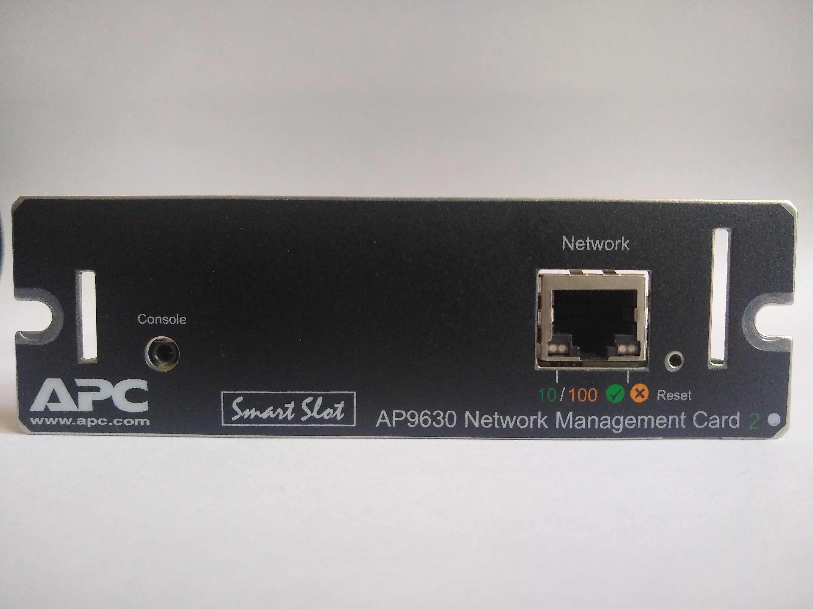
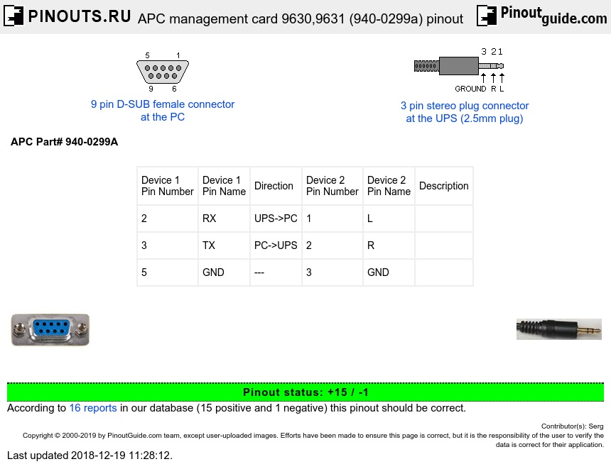
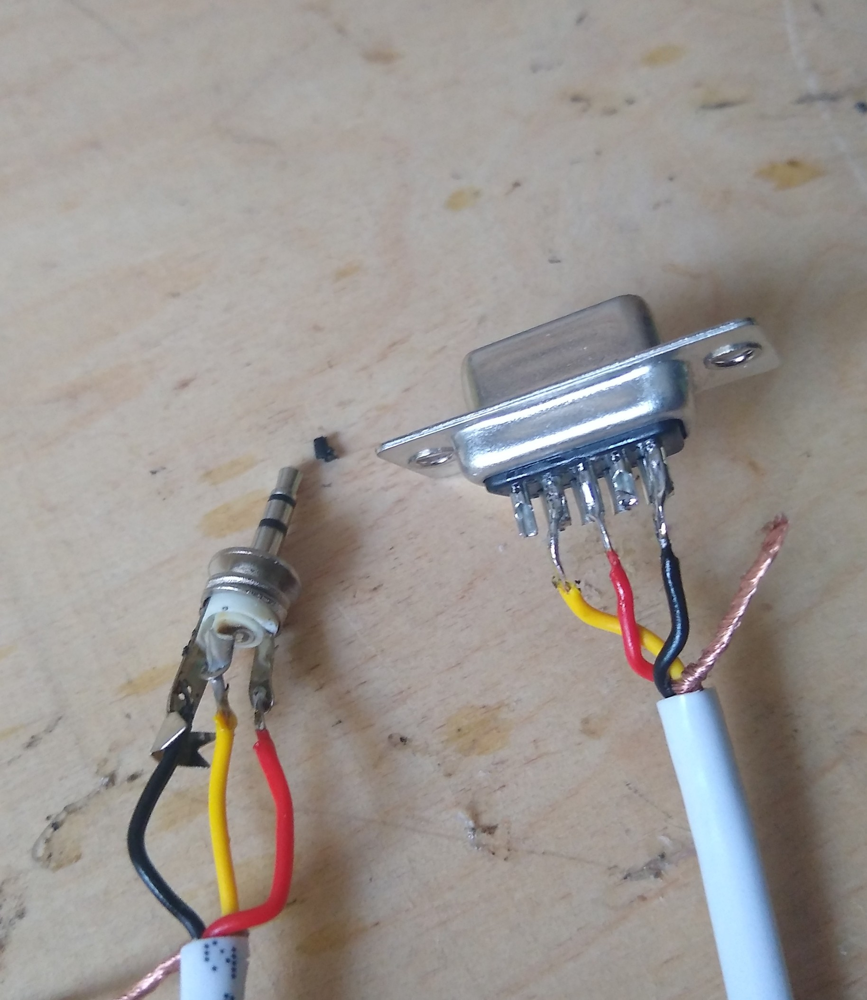
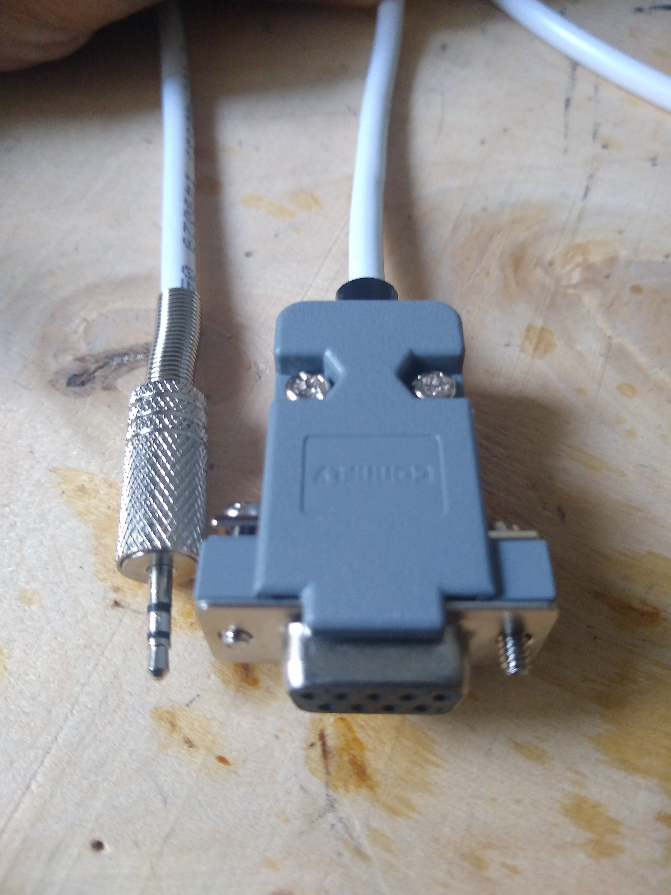
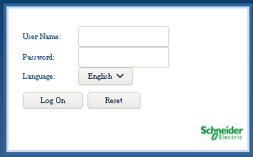
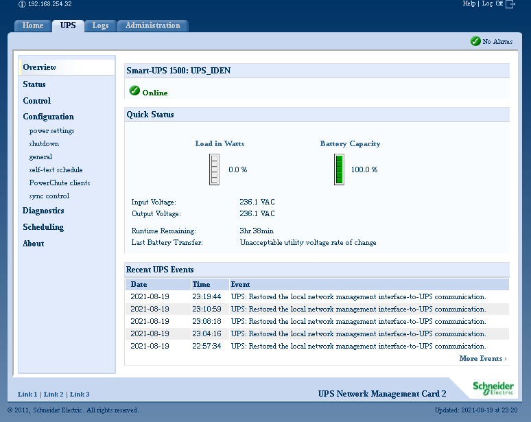

Источник бесперебойного питания APC Smart-UPS 1500
==================================================

Содержание
----------

[[!toc startlevel=2 levels=3]]

Калибровка новых батарей
------------------------

Последовательность калибровки новых батарей такова:

* Вставляем новые батареи в ИБП.
* На задней панели ИБП между разъёмом COM-порта и светодиодом есть белая кнопка с надписью SENSIVITY. Для сброса таблицы калибровки батареи к заводским значениям нужно нажать кнопку SENSIVITY и одновременно включить ИБП.
* Заряжаем новые батареи до 100%.
* Включаем в ИБП нагрузку минимум в 15% от номинальной мощности ИБП, выдёргиваем питание из розетки и ждём полной разрядки батареи. Для успешной калибровки нагрузка должна быть постоянной, не прерываться и не меняться в процессе калибровки. Я для калибровки ИБП мощностью 1500 Ватт воспользовался нагревателем с режимами мощностью 1000 и 2000 Ватт, включив режим с мощностью 1000 Ватт.
* Когда батареи полностью разрядятся и ИБП отключит всю нагрузку, калибровка батареи будет завершена.

Карта управления AP9630
-----------------------

Карта управления AP9631
-----------------------

Консольный кабель
-----------------

Карта APC AP9631 снабжена консольным портом, через который её можно соединить с последовательным портом компьютера. Порт представляет собой гнездо мини-джек диаметром 2,5 миллиметра. Схему консольного кабеля можно найти по ссылке [APC management card 9630,9631 (940-0299a) pinout](https://pinoutguide.com/UPS/apc_management_card_pinout.shtml).

Для пайки кабеля приобрёл следующие детали:

|Наименование                                                |Количество|Цена, руб.|
|:-----------------------------------------------------------|:--------:|---------:|
|Штекер «Джек 2,5 мм» (стерео) мет.                          |         1|33,25     |
|Кабель видеонаблюдения ШВЭВ (ШСМ) 3*0,12 кв.мм, белый REXANT|   3 метра|68,40     |
|Разъем DB-09F                                               |         1|11,04     |
|Корпус разъема DP-09C                                       |         1|15,64     |
|Итого:                                                                ||128,33    |

Сброс карты управления
----------------------

Для сброса настроек аутентификации нужно нажать кнопку сброса скрепкой и удерживать в течение 20 секунд. За процессом сброса можно следить по зелёному и жёлтому светодиодам под гнездом Ethernet:

- зелёный мигающий - нажата кнопка сброса,
- жёлтый мигающий - начало сброса - отпускаем кнопку,
- погас - карта ушла в перезагрузку,
- жёлтый и зелёный мигают часто - загрузка карты управления,
- жёлтый и зелёный мигают редко - загрузка карты управления завершена.

Видеозапись процесса сброса карты управления:

Подключение к карте управления
------------------------------

Для подключения к консоли карты управления я воспользовался описанным выше кабелем и программой minicom.

Для изменения настроек minicom, используемых по умолчанию, можно воспользоваться такой командой:

    # minicom -s

По умолчанию COM-порт маршрутизатора настроен так:

* Скорость обмена данными - 9600 бод
* Контроль чётности - отсутствует
* Битов данных - 8
* Стоп-битов - 1

После явного ручного указания всех этих настроек у меня получился такой файл /etc/minicom/minirc.dfl:

    # Автоматически сгенерированный файл - используйте "minicom -s" для
    # изменения параметров.
    pu port             /dev/ttyUSB0
    pu baudrate         9600
    pu bits             8
    pu parity           N
    pu stopbits         1

Теперь для подключения к консоли осталось просто запустить команду:

    # minicom

Выйти из minicom можно по нажатию следующих клавиш:

    Ctrl+A Z Q

По умолчанию на кате управления настроен пользователь apc с паролем apc. Если эти учётные данные не подходят, попробуйте сбросить настройки карты управления описанным выше способом.

Прошивка версии 6.9.6 при первом входе попросит поменять пароль пользователя apc, а также отображает информацию о настроенных сетевых интерфейсах, запущенных сетевых сервисах и настроенных пользователях:

    User Name : apc
    Password  : ***
    
    The current password policy requires you to change your password...
    
    Enter current password: ***
    
    Enter new password: **********
    Confirm new password: **********
    
    Schneider Electric                      Network Management Card AOS      v6.9.6
    (c) Copyright 2020 All Rights Reserved  Smart-UPS & Matrix-UPS APP       v6.9.6
    -------------------------------------------------------------------------------
    Name      : apc9943CD                                 Date : 08/21/2021
    Contact   : Unknown                                   Time : 23:03:49
    Location  : Unknown                                   User : Super User
    Up Time   : 0 Days 0 Hours 0 Minutes                  Stat : P+ N4+ N6+ A+
    -------------------------------------------------------------------------------
    IPv4               : Enabled            IPv6               : Enabled
    Ping Response      : Enabled
    -------------------------------------------------------------------------------
    HTTP               : Disabled           HTTPS              : Enabled
    FTP                : Disabled           Telnet             : Disabled
    SSH/SCP            : Enabled            SNMPv1             : Disabled
    SNMPv3             : Disabled
    -------------------------------------------------------------------------------
    Super User         : Enabled            RADIUS             : Disabled
    Administrator      : Disabled           Device User        : Disabled
    Read-Only User     : Disabled           Network-Only User  : Disabled
    
    
    Type ? for command listing
    Use tcpip command for IP address(-i), subnet(-s), and gateway(-g)

Командная строка
----------------

Список поддерживаемых картой управления команд можно узнать при помощи команды `?` или полностью эквивалентной ей команды `help`:

Команды, поддерживаемые прошивками 5.1.6 и 5.1.7:

    apc>?
    
    Network Management Card Commands:
    ---------------------------------------------------------------------------
    For command help: command ?
    
    ?           about       alarmcount  boot        cd          clrrst
    console     date        delete      dir         dns         eventlog
    exit        format      ftp         help        netstat     ntp
    ping        portspeed   prompt      quit        radius      reboot
    resetToDef  snmp        snmpv3      system      tcpip       tcpip6
    user        web         xferINI     xferStatus
    
    Device Commands:
    ---------------------------------------------------------------------------
    ups         detstatus   cfgshutdn   cfgpower

Команды, поддерживаемые прошивкой 6.9.6 (ниже я буду описывать именно их):

    apc>help
    
    System Commands:
    ---------------------------------------------------------------------------
    For command help: command ? 
    
    ?           about       alarmcount  boot        bye         cd          
    cipher      clrrst      console     date        delete      dir         
    dns         eapol       email       eventlog    exit        firewall    
    format      ftp         help        lang        lastrst     ledblink    
    logzip      netstat     ntp         ping        portspeed   prompt      
    pwd         quit        radius      reboot      resetToDef  session     
    smtp        snmp        snmptrap    snmpv3      system      tcpip       
    tcpip6      user        userdflt    web         whoami      xferINI     
    xferStatus  
    
    Device Commands:
    ---------------------------------------------------------------------------
    ups         detstatus   cfgshutdn   cfgpower    upsabout    modbus      
    bacnet 

Справку по любой команде можно получить, указав её команде `?` или `help` в качестве аргумента:

    apc>? delete
    Usage: delete --  Configuration Options
        delete <file name>

    apc>help ftp
    Usage: ftp --  Configuration Options
        ftp [-p <port-number>] (21 and 5001-32768)
            [-S <enable | disable>]

Можно поступить наоборот и вызвать интересующую команду с аргументом `?` или `help`, результат будет точно таким же:

    apc>delete ?
    Usage: delete --  Configuration Options
        delete <file name>
    
    apc>ftp help
    Usage: ftp --  Configuration Options
        ftp [-p <port-number>] (21 and 5001-32768)
            [-S <enable | disable>]

Для выхода с карты управления можно воспользоваться одной из трёх команд: `bye`, `exit` или `quit`, причём команда `bye` не доступна на прошивках 5.1.6 и 5.1.7, но работает в прошивке 6.9.6.

При помощи команды `prompt` можно настроить длинное или короткое приглашение командной строки. Длинное отображает имя пользователя и имя системы, а короткое - только имя системы:

    apc>prompt -s long
    E000: Success
    
    Administrator@apc>prompt -s short
    E000: Success

Как можно заметить из примера выше, в ответе команды выводится код ошибки и собщение об ошибке. Так работает подавляющее большинство команд. Возможные коды ошибок и сообщения об ошибках приведены в таблице:

|Код ошибки|Сообщение об ошибке                                |Перевод                                                      |
|:--------:|:--------------------------------------------------|:------------------------------------------------------------|
|E000      |Success                                            |Успех                                                        |
|E001      |Successfully Issued                                |Успешно выпущен                                              |
|E002      |Reboot required for change to take effect          |Для применения настроек требуется перезагрузка               |
|E100      |Command failed                                     |Ошибка выполнения команды                                    |
|E101      |Command not found                                  |Команда не найдена                                           |
|E102      |Parameter Error                                    |Ошибка в параметре                                           |
|E103      |Command Line Error                                 |Ошибка в командной строке                                    |
|E107      |Serial communication with the UPS has been lost    |Потеряна связь с ИБП по последовательной линии               |
|E108      |EAPoL disabled due to invalid/encrypted certificate|EAPoL отключен, т.к. сертификат недействителен или зашифрован|

В соответствии с этой таблицей некоторые команды для применения изменений, внесённых в настройки карты, могут потребовать перезагрузить карту управления:

    E002: Success
    Reboot required for change to take effect.

Перезагрузить карту управления можно с помощью команды `reboot`:

    apc>reboot
    E000: Success
    Reboot Management Interface
    Enter 'YES' to continue or <ENTER> to cancel : YES
    Rebooting...

Перезагрузка карты не приводит к перезагрузке самого ИБП или к отключению запитанной от него нагрузки. Для подтверждкния перезагрузки нужно ввести слово YES и нажать Enter.

Если не перезагрузить карту управления сразу, а продолжать выполнять команды, то в прошивке версии 6.9.6 подобное напоминание будет выводиться после каждой последующей команды:

    * Reboot required for change to take effect.

Просмотр общих сведений
-----------------------

При помощи команды upsabout можно узнать модель ИБП, его серийный номер, версию прошивки и дату производства:

    apc>upsabout
    E000: Success
    Model: Smart-UPS 1500
    Serial Number: AS0508120261
    Firmware Revision: 601.3.I
    Manufacture Date: 02/14/05

При помощи аналогичной комнады about можно узнать модель карты управления, её серийный номер, дату производства, MAC-адрес и версии установленных прошивок:

    apc>about
    E000: Success
    Hardware Factory
    ---------------
    Model Number:           AP9630
    Serial Number:          ZA1246002369
    Hardware Revision:      05
    Manufacture Date:       11/05/2012
    MAC Address:            00 C0 B7 99 43 CD
    Management Uptime:      0 Days 0 Hours 19 Minutes
    
    Application Module
    ---------------
    Name:                   sumx
    Version:                v6.9.6
    Date:                   Nov  6 2020
    Time:                   11:08:39
    
    APC OS(AOS)
    ---------------
    Name:                   aos
    Version:                v6.9.6
    Date:                   Nov  5 2020
    Time:                   08:31:17
    
    APC Boot Monitor
    ---------------
    Name:                   bootmon
    Version:                v1.0.9
    Date:                   Mar 27 2019
    Time:                   16:23:06
    
В карте есть три пошивки:

* bootmon - начальный загрузчик,
* aos - операционная система American Power Conversion,
* sumx - приложение Smart-UPS/Matrix, которое отвечает за веб-интерфейс карты управления. Если это приложение по каким-либо причинам не установлено, то вместо него в выводе команды можно будет увидеть ещё один начальный загрузчик bootmon. Веб-интерфейс при этом будет отображать страницу-заглушку.

В краткой форме версии прошивок можно также увидеть в выводе команды `system`.

Начальная настройка
-------------------

Начать настройку можно с указания имени узла, контактных данных администратора, строки местоположения и произвольного сообщения:

    apc>system -n apc1500 -s enable -c vladimir@stupin.su -l "Ufa" -m "UPS for stupin.su"
    E000: Success                                                                   

Опция `-s enable` включает синхронное изменение имени узла и доменного имени, настраиваемого при помощи команды `dns`. Отключить его можно при помощи опции `-s disable`. В таком случае доменное имя может и имя узла могут отличаться друг от друга и настраиваться независимо.

Для просмотра сведений о системе достаточно ввести команду `system` бе аргументов: 

    apc>system                        
    E000: Success
    Host Name Sync: Enabled
    Name:           apc1500
    Contact:        vladimir@stupin.su
    Location:       Ufa
    Message:        UPS for stupin.su
    DateTime:       08/24/2021:20:25:40
    User:           apc
    Up Time:        0 Days 0 Hours 27 Minutes
    Stat:           P+ N+ A+
    Bootmon:        bootmon:v1.0.9
    AOS:            aos:v6.9.6
    App:            sumx:v6.9.6

Как видно, в последних строчках вывода команды можно увидеть краткую информацию о версиях установленных прошивок. Более подробную информацию можно увидеть в выводе команды `about`.

Продолжить начальную настройку можно установкой формата времени гггг-мм-дд и настройкой текущей даты, времени и часового пояса:

    apc>date -f yyyy-mm-dd -d 2021-08-18 -t 22:19:45 -z +05:00
    E000: Success

Просмотреть текущие настройки времени можно при помощи той же команды `date` без аргументов:

    apc>date
    E000: Success
    Date: 2021-08-18
    Time: 22:20:20
    Format: yyyy-mm-dd
    Time Zone: +05:00

Для настройки синхронизации времени с серверами NTP можно воспользоваться командой `ntp`, которая будет описана ниже.

Настройка пользователей
-----------------------

Прежде чем приступить к настройке сети, познакомимся с настроенными в системе пользователями. Для этого можно вызвать команду `user` без аргументов или с опцией `-l`:

    apc>user
    E000: Success
    Name                    User Type                      Status
    ----                    ---------                      ------
    apc                     Super User                     Enabled
    device                  Device                         Disabled
    readonly                Read-Only                      Disabled

В системе имеется три пользователя. Если вы вдруг забыли, под каким пользователем зашли в систему, то это можно легко вспомнить с помощью команды `whoami`:

    apc>whoami
    E000: Success
    apc

Текущие настройки любого из пользователей можно посмотреть при помощи команды `user`, указав опции `-n` в качестве аргумента имя интересующего пользователя:

    apc>user -n apc
    E000: Success
    Access: Enabled 
    User Name: apc
    Password: <hidden>
    User Permission: Super User
    User Description: User Description
    Session Timeout: 3 minutes
    Serial Remote Authentication Override: Disabled
    Event Log Color Coding: Enabled
    Export Log Format: Tab
    Temperature Scale: Metric
    Date Format: mm/dd/yyyy
    Language: English (enUs)

Поменять пароль пользователя readonly можно следующим образом:

    apc>user -n readonly -pw iis1uexoothuj2Oo
    E000: Success

Если пользователя с указанным именем нет в системе, то он будет создан! Все остальные настройки будут заполнены значениями по умолчанию.

Для включения пользователя можно воспользоваться командой следующего вида:

    apc>user -n device -e enable
    E000: Success

При попытке отключить пользователя с привилегиями администратора выводится предупреждение о том, что в системе должен быть хотя бы один включенный пользователь с правами администратора, однако сама команда при этом выполняется успешно:

    apc>user -n apc -e disable
    
    Note: Disabling the Super User account may have undesired effects! Ensure
    at least one user on the system is enabled and has Administrator privileges.
    E000: Success

Вот так можно настроить для пользователя apc время автоматического завершения сеанса через 10 минут неактивности, отображение данных в метрической системе единиц, отображение дат в формате гггг-мм-дд и русский язык:

    apc>user -n apc -st 10 -ts metric -df yyyy-mm-dd -lg ruRU
    E000: Success

Настройки языка влияют только на язык веб-интерфейса, а выбрать язык, отличный от английского, можно только при установке соответствующего пакета языковой поддержки. Установка пакетов языковой поддержки описана ниже, в разделе про обновление прошивок.

Посмотреть список доступных языков можно при помощи команды `lang`:

    apc>lang
    E000: Success
    
    Languages
    enUs - English
    frFr - Français
    deDe - Deutsch
    ruRu - Русский
    itIt - Italiano
    esEs - Español

Кроме этого, для каждого пользователя можно настроить строчку с его описанием:

    apc>user -n apc -d "DevOps is for Device Operators"           
    E000: Success

Для полного удаления пользователя из системы можно воспользоваться командой следующего вида:

    apc>user -del device
    E000: Success

Создать нового пользователя можно при помощи точно такой же команды, с помощью которой можно изменить пароль существующего пользователя:

    apc>user -n readonly -pw iis1uexoothuj2Oo
    E000: Success

Настройки, не указанные при создании пользователя явным образом, будут заполнены значениями по умолчанию.

Посмотреть настройки, используемые по умолчанию при создании новых пользователей, можно при помощи команды `userdflt` без агрументов:

    apc>userdflt
    E000: Success
    Access: Disabled
    User Permission: Administrator
    User Description: User Description
    Session Timeout: 3 minutes
    Bad Login Attempts: 0
    Event Log Color Coding: Enabled
    Export Log Format: Tab
    Temperature Scale: Metric
    Date Format: mm/dd/yyyy
    Language: English (enUs)
    Strong Passwords: Disabled
    Require Password Change: 0 day(s) (Disabled)

Вот так можно настроить пустое описание пользователя, метрическую систему, формат даты гггг-мм-дд, русский язык в веб-интерфейсе и требование использовать сложные пароли для всех новых пользователей:

    apc>userdflt -d "" -ts metric -df yyyy-mm-dd -lg ruRU -sp enable
    E000: Success

Карта управления умеет работать с пользователями, настроенными на сервере RADIUS, однако для этого понадобится настроить сетевой интерфейс.

Настройка Ethernet-интерфейса
-----------------------------

Для просмотра канальной скорости на Ethernet-интерфейсе предназначена команда `portspeed`:

    apc>portspeed
    E000: Success
    Port Speed: Auto_negotiation
    Current Port Speed: 100 Full_Duplex

Как видно из вывода команды, сейчас настроено автоматическое согласование скорости и согласована скорость 100 Мбит/с в обе стороны одновременно.

При необходимости можно выставить канальную скорость вручную:

    apc>portspeed -s 10H
    E002: Success
    Reboot required for change to take effect.

Список возможных канальных скоростей, которые можно указать команде `portspeed` вместе с опцией `-s`:

* auto - автоматическое согласование канальной скорости,
* 10H - 10 Мбит/с поочерёдно,
* 10F - 10 Мбит/с в обе стороны одновременно,
* 100H - 100 Мбит/с поочерёдно,
* 100F - 100 Мбит/с в обе стороны одновременно.

Для просмотра IP-адресов, настроенных на сетевом интерфейсе, предусмотрена команда `netstat`, не принимающая аргументов:

    apc>netstat
    
    Current IP Information:
    
    Family mHome Type   IPAddress                                         Status    
    IPv6   4     auto   FE80::2C0:B7FF:FE99:43CD/64                       configured
    IPv4   0     dhcp   192.168.254.32/24                                 configured
    IPv6   0     manual ::1/128                                           configured
    IPv4   0     manual 127.0.0.1/32                                      configured

В первой колонке указаны семейства адресов - IPv4 и IPv6. Для настройки адресов семейства IPv4 предназначена команда `tcpip`, а для настройки адресов семейства IPv6 предусмотрена команда `tcpip6`. Адреса ::1/128 и 127.0.0.1/32 соответствуют локальному петлевому интерфейсу настройке не подлежат.

Для отключени настройки адресов семейства IPv6 можно воспользоваться командой следующего вида:

    apc>tcpip6 -S disable
    E002: Success
    Reboot required for change to take effect.

Для просмотра настроек IPv6 можно воспользоваться командой без аргументов:

    apc>tcpip6
    E000: Success
    
    IPv6:                   disabled
    Manual Settings:        disabled
    
    IPv6 Address:           ::/64
    MAC Address:            00 C0 B7 99 43 CD
    Gateway:                ::
    IPv6 Manual Address:    disabled
    IPv6 Autoconfiguration: enabled
    DHCPv6 Mode:            router controlled

Аналогично можно отключить и настройку адресов семейства IPv4. При отключении соответствующие адреса на интерфейсе настраиваться не будут в принципе, даже если включено получение настроек от сервера DHCP или настройки указаны вручную. Будьте внимательны!

Вручную настройки IPv4 можно указать следующим образом:

    apc>tcpip -S enable -i 192.168.254.32 -s 255.255.255.0 -g 192.168.254.1 -d lo.stupin.su -h apc1500
    E000: Success

При помощи опции `-S enable` включается настройка адресов IPv4. В опциях `-i`, `-s` и `-g` задаются IP-адрес интерфейса, маска сети и IP-адрес сетевого шлюза. В опциях `-d` и `-h` можно указать домен и доменное имя узла. У опции `-h` есть одна особенность: нельзя задать в качестве имени узла имя apc - оно автоматически дополняется шестью последними цифрами MAC-адреса карты управления. Поэтому я указал имя apc1500.

После перезагрузки карты управления настройки будут выглядеть следующим образом:

    apc>tcpip
    E000: Success
    
    Active IPv4 Settings
    --------------------
      Active IPv4 Address:          192.168.254.32
      Active IPv4 Subnet Mask:      255.255.255.0
      Active IPv4 Gateway:          192.168.254.1
    
    Manually Configured IPv4 Settings
    ---------------------------------
    
      IPv4:                 enabled
      Manual Settings:      enabled
    
      IPv4 Address:         192.168.254.32
      Subnet Mask:          255.255.255.0
      Gateway:              192.168.254.1
      MAC Address:          00 C0 B7 99 43 CD
      Domain Name:          lo.stupin.su
      Host Name:            apc1500

Для автоматической настройки сетевого интерфейса по протоколу DHCP предусмотрена команда `boot`, которая при запуске без аргументов выводит свои текущие настройки:

    apc>boot
    E000: Success
    
    Boot Mode:      dhcp
    DHCP Cookie:    disable
    Vendor Class:   APC
    Client ID:      00 C0 B7 5F 54 00
    User Class:     SUMX

Каждую из этих настроек можно изменить, но на практике может понадобиться лишь либо включить клиента DHCP, либо отключить его:

    apc>boot -b dhcp
    E002: Success
    Reboot required for change to take effect.

При включении клиента DHCP автоматически отключается использование ручных настроек, указанных команде `tcpip`.  При этом сами настройки никуда не пропадают и для того, чтобы вернуться к их использованию, достаточно вернуться к режиму ручных настроек:
    
    apc>boot -b manual
    E002: Success
    Reboot required for change to take effect.

После изменения настроек не забудьте перезагрузить сетевую карту.

Проверить работу сетевого интерфейса можно при помощи команды `ping`:

    apc>ping 192.168.254.1
    Reply from 192.168.254.1: time(ms)= <10
    Reply from 192.168.254.1: time(ms)= <10
    Reply from 192.168.254.1: time(ms)= <10
    Reply from 192.168.254.1: time(ms)= <10

Настройка клиента DNS
---------------------

При настроенном клиенте DNS можно использовать в команде `ping` не только IP-адреса, но и доменные имена сетевых узлов.

Просмотреть текущие настройки DNS можно при помощи команды `dns` без аргументов:

    apc>dns             
    E000: Success
    Active Primary DNS Server:      192.168.254.1
    Active Secondary DNS Server:    0.0.0.0
    
    Override Manual DNS Settings:   disabled
    Primary DNS Server:             0.0.0.0
    Secondary DNS Server:           0.0.0.0
    Domain Name:                    lo.stupin.su
    Domain Name IPv6:               lo.stupin.su
    System Name Sync:               Enabled
    Host Name:                      apc1500

Включить синхронизацию имени системы с доменным именем можно следующим образом:

    apc>dns -y enable
    E000: Success

Отключить синхронизацию имени можно, как вы наверное уже догадались, следующим образом:

    apc>dns -y disable
    E000: Success

Если с помощью команды boot было включено получение настроек интерфейса по протоколу DHCP, то будут использоваться адреса DNS-серверов, полученные от DHCP-сервера.

Для использования других DNS-серверов можно включить функцию замены IP-адресов серверов и указать IP-адреса первичного и вторичного DNS-серверов:

    apc>dns -OM enable -p 192.168.253.1 -s 192.168.252.1
    E000: Success

Чтобы отключить использование DNS-серверов, указанных вручную, можно воспользоваться такой командой:

    apc>dns -OM disable
    E000: Success

С помощью следующей команды можно настроить имя узла и домены для сетей IPv4 и IPv6:

    apc>dns -h apc1500 -d lo.stupin.su -n lo.stupin.su
    E000: Success

Зачем предусмотрена отдельная настройка домена для сети IPv6 - для меня осталось загадкой.

При помощи команды `dns` тоже нельзя настроить в качестве имени узла имя apc - оно автоматически дополняется шестью последними цифрами MAC-адреса карты управления.

Если DNS-клиент настроен, то можно использовать доменные имена в команде `ping`:

    apc>ping stupin.su
    Reply from stupin.su: time(ms)= <10
    Reply from stupin.su: time(ms)= <10
    Reply from stupin.su: time(ms)= <10
    Reply from stupin.su: time(ms)= <10

Настройка синхронизации времени
-------------------------------

Для просмотра настроек NTP-серверов можно воспользоваться командой `ntp` без аргументов:

    apc>ntp
    E000: Success
    Active Primary NTP Server:      0.0.0.0
    Active Secondary NTP Server:    0.0.0.0
    
    Override Manual NTP Settings:   Disabled
    Primary NTP Server:             0.0.0.0
    Secondary NTP Server            0.0.0.0

Если было включено получение настроек по протоколу DHCP, то будут использоваться адреса NTP-серверов, полученные от DHCP-сервера.

Выставить IP-адреса серверов NTP вручную можно следующим образом:

    apc>ntp -OM enable -p 192.168.254.1 -s 192.168.253.1
    E000: Success

Для отключения использования IP-адресов серверов NTP, указанных вручную, можно воспользоваться такой командой:

    apc>ntp -OM disable
    E000: Success

Управление сеансами
-------------------

Прежде чем перейти к настройке сервисов, предоставляемых картой управления, хочется рассмотреть управление сеансами пользователей. Каждый раз, когда пользователь подключается к карте управления через последовательную консоль, по SSH, через Telnet, заходит в веб-интерфейс или подключается FTP-клиентом ко встроенному серверу FTP, карта обновляет список активных сеансов. Посмотреть на него можно с помощью команды `session` без аргументов:

    apc>session
    User              Interface         Address           Logged In Time    ID
    -------------------------------------------------------------------------------
    apc               Serial                              00:12:35          1
    E000: Success

При помощи этой же команды можно завершать установленные сеансы других пользователей или даже свой собственный:

    apc>session -d 1
    E000: Success
    
    Bye.

А чтобы к карте управления не смогло подключиться больше одного пользователя одновременно, можно воспользоваться такой командой:

    apc>session -m disable
    E000: Success

Если в это время попытаться подключиться к карте управления, например, по SSH, то подключение не будет установлено с сообщением о превышении максимального количества разрешённых сеансов:

    $ ssh apc@apc1500.lo.stupin.su
    apc@apc1500.lo.stupin.su's password: 
    
    Max logins exceeded.Connection to apc1500.lo.stupin.su closed by remote host.
    Connection to apc1500.lo.stupin.su closed.

Чтобы вновь разрешить подключаться к карте управления одновременно нескольким польователям, нужно разрешить одновременные подключения следующим образом:

    apc>session -m enable  
    E000: Success

Теперь можно приступить к настройке сетевых сервисов.

Настройка консоли, SSH и Telnet
-------------------------------

### console

Управление консолью на последовательном порту, telnet и SSH.

Для просмотра текущих настроек можно вызвать команду следующим образом:

    apc>console
    E000: Success
    Service:     disabled
    Telnet Port: 23
    SSH Port:    22
    Baud Rate:   9600

В прошивке 6.9.6 по сравнению с прошивками 5.1.6 и 5.1.7 появилась очевидная возможность включать и выключать сервисы Telnet и SSH независимо друг от друга, в том числе включить оба сразу:

    apc>console
    E000: Success
    Telnet:      enabled
    SSH:         enabled
    Telnet Port: 23
    SSH Port:    22
    Baud Rate:   9600

Включить сервис SSH на порту 22 в прошивках 5.1.6 и 5.1.7 можно так:

    apc>console -S ssh -ps 22
    E002: Success
    Reboot required for change to take effect.

В прошивке 6.9.6 сервис SSH на порту 22 включается следующим образом:

    apc>console -s enable -ps 22
    E002: Success
    Reboot required for change to take effect.

Аналогичным образом в прошивках 5.1.6 и 5.1.7 можно включить сервис telnet на порту 23:

    apc>console -S telnet -pt 23
    E002: Success
    Reboot required for change to take effect.

В прошивке 6.9.6 telnet на порту 23 можно включить следующим образом:

    apc>console -t enable -pt 23
    E002: Success
    Reboot required for change to take effect.

К сожалению или к счастью, но консоль на последовательном порту отключить нельзя, а из сервисов telnet и SSH в прошивках 5.1.6 и 5.1.7 можно выбрать только один, либо отключить их оба, например так:

    apc>console -S disable
    E002: Success
    Reboot required for change to take effect.

В прошивке 6.9.6 реализована возможность одновременного включения как telnet, так и SSH, а для их отключения предусмотрены отдельные команды:

    apc>console -t disable
    E002: Success
    Reboot required for change to take effect.
    
    
    * Reboot required for change to take effect.
    apc>console -s disable
    E002: Success
    Reboot required for change to take effect.
    
    
    * Reboot required for change to take effect.

Как видно из вывода команд, при включении или отключении сервисов, изменении их портов, для применения настроек потребуется перезагрузить карту управления с помощью команды reboot.

Чтобы поменять скорость на последовательном порту, можно воспользоваться командой следующего вида:

    apc>console -b 38400 
    E000: Success

Настроить можно только одну из скоростей из списка в 2400, 9600, 19200 и 38400 бод.

Настройка веб-интерфейса
------------------------

### web

Просмотр настроек и настройка веб-интерфейса.

Для просмотра текущих настроек веб-интерфейса нужно запустить команду web без аргументов:

    apc>web
    E000: Success
    Service:        http
    Http Port:      80
    Https Port:     443

Для включения защищённой версии веб-интерфейса можно воспользоваться такой командой:

    apc>web -S https -ps 443
    E002: Success
    Reboot required for change to take effect.

Вернуть или включить незащищённую версию веб-интерфейса можно так:

    apc>web -S http -ph 80   
    E002: Success
    Reboot required for change to take effect.

При включении защищённой версии веб-интерфейса на незащищённой версии отображается страница-заглушка. Защищённая версия в моём браузере не открылась, т.к. веб-сервер не поддерживает SSL 3.0 или TLS, а браузер не поддерживает протоколы SSL 1.0 и SSL 2.0.

Вот более подробная диагностика:

    $ gnutls-cli-debug -p 443 apc1500.lo.stupin.su
    GnuTLS debug client 3.6.7
    Checking apc1500.lo.stupin.su:443
                            whether we need to disable TLS 1.2... yes
                            whether we need to disable TLS 1.1... yes
                            whether we need to disable TLS 1.0... yes
                            whether %NO_EXTENSIONS is required... yes
                                   whether %COMPAT is required... yes
                                 for TLS 1.0 (RFC2246) support... no
     for TLS 1.0 (RFC2246) support with TLS 1.0 record version... no
                                 for TLS 1.1 (RFC4346) support... no
                                      fallback from TLS 1.1 to... failed
                                 for TLS 1.2 (RFC5246) support... no
                                 for TLS 1.3 (RFC8446) support... no
                           TLS1.2 neg fallback from TLS 1.6 to... failed (server requires fallback dance)
    
    Server does not support any of SSL 3.0, TLS 1.0, 1.1, 1.2 and 1.3

Для отключения веб-интерфейса предназначена такая команда:

    apc>web -S disable
    E002: Success
    Reboot required for change to take effect.

Для применения настроек нужно перезагрузить карту управления при помощи команды reboot.

Часть настроек, например, для отправки уведомлений на электронную почту, можно поменять только через веб-интерфейс. Поэтому для изменения каких-то специфичных настроек, которые нельзя поменять из командной строки, его всё же придётся включать.

Страница входа в прошивках версий 5.1.6 и 5.1.7:

Страница состояния ИБП в прошивках версий 5.1.6 и 5.1.7:

### cipher

Настрйока криптографических алгоритмов для HTTPS.

*Команда не поддерживается в прошивках 5.1.6 и 5.1.7 на картах управления AP9630 и AP9631.*

В версии 6.9.6 команда без аргументов выводит следующую информацию:

    apc>cipher
    E000: Success
    Key Exchange Algorithms
    -----------------------
    
            DH                   enabled
            RSA Key Exchange     enabled
            ECDHE                enabled
    
    Authentication Algorithms
    -------------------------
    
            RSA Authentication   enabled
    
    Cipher Algorithms
    -----------------
    
            AES                  enabled
    
    MAC Algorithms
    --------------
    
            SHA                  enabled
            SHA256               enabled
    
    
    Available Cipher Suites
    -----------------------
    
    1       TLS_ECDHE_ECDSA_WITH_AES_128_CBC_SHA
    2       TLS_ECDHE_ECDSA_WITH_AES_256_CBC_SHA
    3       TLS_ECDHE_RSA_WITH_AES_128_CBC_SHA
    4       TLS_ECDHE_RSA_WITH_AES_256_CBC_SHA
    5       TLS_DHE_RSA_WITH_AES_128_CBC_SHA
    6       TLS_DHE_RSA_WITH_AES_128_CBC_SHA256
    7       TLS_DHE_RSA_WITH_AES_256_CBC_SHA
    8       TLS_DHE_RSA_WITH_AES_256_CBC_SHA256
    9       TLS_RSA_WITH_AES_128_CBC_SHA
    10      TLS_RSA_WITH_AES_256_CBC_SHA
    11      TLS_RSA_WITH_AES_128_CBC_SHA256
    12      TLS_RSA_WITH_AES_256_CBC_SHA256
    
    Blocked Cipher Suites
    ---------------------
    (the settings above disable the suites listed here)
    
    None

Настройка встроенного FTP-сервера
---------------------------------

### ftp

Просмотр настроек и настройка встроенного FTP-сервера.

Для просмотра текущих настроек достаточно ввести команду ftp без аргументов:

    apc>ftp
    E000: Success
    Service:        Enabled
    Ftp Port:       21

Для включения встроенного FTP-сервера на 21 порту можно воспользоваться следующей командой:

    apc>ftp -S enable -p 21
    E002: Success
    Reboot required for change to take effect.

Отключить встроенный FTP-сервер можно так:

    apc>ftp -S disable
    E002: Success
    Reboot required for change to take effect.

Для применения настроек потребуется перезагрузка карты управления, которую можно инициировать с помощью команды reboot.

Через встроенный FTP-сервер можно скачать файл конфигурации config.ini, прошивки, текстовые журналы. Также, насколько я понимаю, через встроенный FTP-сервер можно обновить прошивку карты управления.

См. также команды cd, delete, dir, format и pwd.

Управление файлами
------------------

### pwd

Просмотр текущего каталога.

*Команда не поддерживается в прошивках 5.1.6 и 5.1.7 на картах управления AP9630 и AP9631.*

### dir

Просмотр содержимого текущего каталога в прошивках 5.1.6 и 5.1.7:

    apc>dir
    E000: Success
    --wx-wx-wx  1 admin      admin      2287872 May 11 2011   apc_hw05_aos_516.bin
    --wx-wx-wx  1 admin      admin      2143508 Aug 11 2011   apc_hw05_sumx_516.bin
    -rw-rw-rw-  1 admin      admin        45000 Aug 18 22:45  config.ini
    drwxrwxrwx  1 admin      admin            0 Sep 13 2001   db/
    drwxrwxrwx  1 admin      admin            0 Nov 22 2011   ssl/
    drwxrwxrwx  1 admin      admin            0 Nov 22 2011   ssh/
    drwxrwxrwx  1 admin      admin            0 Nov 22 2011   logs/
    drwxrwxrwx  1 admin      admin            0 Nov 22 2011   sec/
    drwxrwxrwx  1 admin      admin            0 Nov 22 2011   dbg/
    drwxrwxrwx  1 admin      admin            0 Nov 22 2011   lang/
    drwxrwxrwx  1 admin      admin            0 Nov 22 2011   upsfw/
    drwxrwxrwx  1 admin      admin            0 Nov 22 2011   rms/
    drwxrwxrwx  1 admin      admin            0 Nov 22 2011   scg/

В прошивке версии 6.9.6 не показываются права доступа, владелец и группа владельцев файлов:

    apc>dir
    E000: Success
         3137536 Nov  5  2020  apc_hw05_aos_696.bin
         3018116 Nov  6  2020  apc_hw05_sumx_696.bin
           45000 Aug 21 22:31  config.ini
               0 Feb  6  2136  db/
               0 Nov  5  2012  ssl/
               0 Nov  5  2012  ssh/
               0 Nov  5  2012  logs/
               0 Nov  5  2012  sec/
               0 Nov  5  2012  dbg/
               0 Nov  5  2012  lang/
               0 Nov  5  2012  upsfw/
               0 Nov  5  2012  rms/
               0 Nov  5  2012  scg/
               0 Aug 21 19:18  fwl/
               0 Aug 21 19:18  email/
               0 Aug 21 19:18  eapol/
               0 Aug 21 19:20  tmp/

См. также команды cd, pwd, delete, format.

### cd

Смена текущего каталога.

Переход в корневой каталог:

    apc>cd /
    E000: Success

Переход в подкаталог logs:

    apc>cd logs
    E000: Success

См. также команды delete, dir, format и pwd.

### delete

Удаление файлов.

Для удаления файла нужно указать команде его имя. Т.к. карта управления не поддерживает команд копирования, создания или изменения файлов, то лишним файлам, которые можно было бы удалить, взяться практически неоткуда. Единственный источник лишних файлов - это встроенный FTP-сервер (см. команду ftp).

См. также команды cd, dir, format и pwd.

### format

Очистка флэш-памяти карты управления:

    apc>format
    
     Format FLASH file system
    
    
    
     Warning: This will delete all configuration data,
              event and data logs, certs and keys.
    
    Enter 'YES' to continue or <ENTER> to cancel : YES
    
    Now initializing system to factory defaults
    Please wait...
    
    Please reboot system to complete this task.

Другие команды
--------------

### alarmcount

Вывод счётчиков событий.

При вызове без аргументов выводит общее количество событий:

    apc>alarmcount
    E000: Success
    AlarmCount: 0

Ту же самую информацию выводит и эта команда:

    apc>alarmcount -p all
    E000: Success
    AlarmCount: 0

Количество предупреждений:

    apc>alarmcount -p warning
    E000: Success
    WarningAlarmCount: 0

Количество критических событий:

    apc>alarmcount -p critical
    E000: Success
    CriticalAlarmCount: 0

В прошивке версии 6.9.6 дополнительно поддерживается так же счётчик количества информационных событий:

    apc>alarmcount -p informational
    E000: Success
    InformationalAlarmCount: 0

### bacnet

Настройка интерфейса [BACnet](https://ru.wikipedia.org/wiki/BACnet).

*Команда не поддерживается в прошивках 5.1.6 и 5.1.7 на картах управления AP9630 и AP9631.*

В прошивке 6.9.6 эта команда без аргументов выдаёт следующую информацию:

    apc>bacnet
    E000: Success
    Enabled:                no
    Device ID:              0
    Device name:            BACnB79943CD
    Network Protocol:       BACnet/IP
    APDU timeout (ms):      6000
    APDU retries:           3
    IP Port:                47808   (0xBAC0)
    Registration Enabled:   no
    Registration Status:    Foreign device registration inactive.
    Registration BBMD:      0.0.0.0
    Registration BBMD port: 47808   (0xBAC0)
    Registration TTL:       7200

### cfgshutdn

Настройка параметров отключения.

### cfgpower

Настройка порогов напряжения.

### clrrst

Сброс причины последнего сброса:

    apc>clrrst
    E000: Success

Не совсем понятно, в чём смысл этой команды.

### detstatus

Просмотр состояния ИБП.

Для просмотра всей доступной информации о состоянии ИБП можно указать опцию `-all`:

    apc>detstatus -all
    E000: Success
    Status of UPS: On Line, No Alarms Present
    Last Transfer: Due to software command or UPS's test control
    Runtime Remaining: 3 hr 35 min
    Battery State Of Charge: 99.0 %
    Output Voltage: 230.4 VAC
    Output Frequency: 50.0 Hz
    Output Watts Percent: 0.0 %
    Input Voltage: 231.8 VAC
    Battery Voltage: 27.8 VDC
    Internal Temperature: 24.3 C, 75.7 F
    Self-Test Result: Not Available
    Self-Test Date: Unknown
    Calibration Result: Not Available
    Calibration Date: Unknown

Другие опции выводят часть этой информации:

    apc>detstatus -ss 
    E000: Success
    Status of UPS: On Line, No Alarms Present
    Last Transfer: Due to software command or UPS's test control
    
    apc>detstatus -rt
    E000: Success
    Runtime Remaining: 3 hr 38 min
    
    apc>detstatus -soc
    E000: Success
    Battery State Of Charge: 100.0 %
    
    apc>detstatus -om 
    E000: Success
    Output Voltage: 230.4 VAC
    Output Frequency: 50.0 Hz
    Output Watts Percent: 0.0 %
    
    apc>detstatus -im
    E000: Success
    Input Voltage: 230.4 VAC
    
    apc>detstatus -bat
    E000: Success
    Battery Voltage: 27.6 VDC
    
    apc>detstatus -tmp
    E000: Success
    Internal Temperature: 24.3 C, 75.7 F
    
    apc>detstatus -dg 
    E000: Success
    Self-Test Result: Not Available
    Self-Test Date: Unknown
    Calibration Result: Not Available
    Calibration Date: Unknown

### eapol

Настройка EAPoL - аутентификации на порту коммутатора.

*Команда не поддерживается в прошивках 5.1.6 и 5.1.7 на картах управления AP9630 и AP9631.*

В прошивке версии 6.9.6 для просмотра текущих настроек можно воспользоваться командой без аргументов:

    apc>eapol
    E000: Success
    
    Active EAPoL Settings
    --------------------
    
      Status:               disabled
      Supplicant Name:      NMC-Supplicant-00:C0:B7:99:43:CD
      Passphrase:           <not set>
      CA file Status:       File not found
      Private Key Status:   File not found
      Public Key Status:    File not found
      Result:               Failed

Для настройки суппликанта его нужно включить, указать имя суппликанта и ключевую фразу. Сертификат и приватный ключ, видимо, нужно поместить в каталог /eapol.

### email

Настройка отправки оповщений на электронную почту.

*Команда не поддерживается в прошивках 5.1.6 и 5.1.7 на картах управления AP9630 и AP9631.*

В прошивке версии 6.9.6 команда поддерживается, но отправка писем по умолчанию, естественно, не настроена:

    apc>email
    E000: Success
    
    No email recipients configured

### eventlog

Просмотр журнала событий:

    apc>eventlog
    E000: Success
    
    
    ---- Event Log -------------------------------------------------
    
         Date: 2021-08-19       Time: 21:19:29
         -------------------------------------
         Smart-UPS 1500 named UPS_IDEN : On Line, No Alarms Present
    
         Date        Time      Event
         ---------------------------------------------------------------------------
         2021-08-19  21:17:24  UPS: Restored the local network management
                                interface-to-UPS communication.
         2021-08-19  21:17:24  System: Network service started. System IP is
                                192.168.254.32 from DHCP server 192.168.254.1 with
                                86390 second lease.
         2021-08-19  21:17:12  System: Console user 'apc' logged in from serial
                                port.
         2021-08-19  21:17:08  System: Network service started. IPv6 address
                                FE80::2C0:B7FF:FE99:43CD assigned by link-local
                                autoconfiguration.
         2021-08-19  21:16:59  System: Network Interface restarted.
         2021-08-19  21:16:47  System: Restarting. Configuration
         2021-08-19  21:13:47  System: Configuration change. System baud rate.
    
       <ESC>- Exit, <ENTER>- Refresh, <SPACE>- Next, <D>- Delete
    > 

Для навигации по содержимому журнала можно использовать следующие клавиши:

  * Escape - выход,
  * Enter - обновить экран,
  * Пробел - показать следующий экран,
  * B - показать предыдущий экран,
  * D - очистить журнал событий.

При попытке очистить журнал событий нужно будет подтвердить операцию набором текста YES, после чего будет выведен журнал с одним событием - очистка журнала:

    ------- Delete log? --------------------------------------------------
    
    Enter 'YES' to continue or <ENTER> to cancel : YES
    
    
    ---- Event Log -------------------------------------------------
    
         Date: 2021-08-19       Time: 21:22:42
         -------------------------------------
         Smart-UPS 1500 named UPS_IDEN : On Line, No Alarms Present
    
         Date        Time      Event
         ---------------------------------------------------------------------------
         2021-08-19  21:22:42  System: Event Log cleared.
    
       <ESC>- Exit, <ENTER>- Refresh, <D>- Delete

### firewall

Настройка фильтрации сетевого трафика.

*Команда не поддерживается в прошивках 5.1.6 и 5.1.7 на картах управления AP9630 и AP9631.*

В прошивке версии 6.9.6 команда поддерживается, но по умолчанию трафик не фильтруется:

    apc>firewall
    E000: Success
    Firewall:       disabled
    File name:      example.fwl

Если скачать по протоколу FTP файл /fwl/example.fwl, то можно увидеть следующее содержимое:

    # rule precedence is lowest to highest priority
    # is a comment
    # priority (number), destination host|range|subnet ip|FQDN|any (port), source host|range|subnet ip|FQDN|any (port), protocol any|tcp|udp|icmp|icmpv6, action allow|discard (log)
    
    # format using host ip
    # priority (number), destination host ip|FQDN|any (port), source host ip|FQDN|any (port), protocol any|tcp|udp|icmp|icmpv6, action allow|discard (log)
    
    # format using ip range
    # priority (number), destination host any, source range ip ip, protocol any|tcp|udp|icmp|icmpv6, action allow|discard (log)
    
    # format using subnet
    # priority (number), destination host any, source subnet 192.168.9.0/24, protocol any|tcp|udp|icmp|icmpv6, action allow|discard (log)
    
    
    #  *************** examples ***************
    
    # highest priority - allow examplehost.example.com all access
    # priority 10, destination any, source host examplehost.example.com, protocol any, action allow
    
    # allow snmp for destination 192.168.9.108 from source 192.168.9.113
    # priority 15, destination host 192.168.9.108 port 161, source host 192.168.9.113, protocol udp, action allow
    
    # discard ip/udp broadcast to the snmp port and log
    # priority 18, destination host 192.168.9.255 port 161, source host any, protocol udp, action discard log
    
    # ipv6 address FE80::214:22FF:FE2B:450A is allowed for everything
    # priority 19, destination host any, source host FE80::214:22FF:FE2B:450A, protocol any, action allow
    
    # discard SNMP from any source and log
    # priority 20, destination host 192.168.9.108 port 161, source host any, protocol udp, action discard log
    
    # allow 192.168.9.113 to ping
    # priority 25, destination host 192.168.9.108, source host 192.168.9.113, protocol icmp, action allow
    
    # discard all icmp including ping and log
    # priority 26, destination host any, source host any, protocol icmp, action discard log
    
    # anyone in range of 192.168.9.50 to 192.168.9.250 is discarded for udp and logged
    # priority 30, destination host any, source range 192.168.9.50 192.168.9.250, protocol udp, action discard log
    
    # anyone can telnet in and log
    # priority 50, destination host 192.168.9.108 port 23, source any, protocol tcp, action allow log
    
    # anyone from subnet 192.168.10.0 is allowed tcp and logged
    # priority 80, destination host any, source subnet 192.168.10.0/24, protocol tcp, action allow log
    
    # anyone from subnet 192.168.10.0 is allowed udp
    # priority 85, destination host any, source subnet 192.168.10.0/24, protocol udp, action allow
    
    # least priority default rule, discard everyone who doesn't fit any of the other rules
    # priority 200, destination host any, source host any, protocol any, action discard
    
    #  *************** end examples ***************
    
    
    # only active rule, allow everyone, no logging
    priority 250, destination host any, source host any, protocol any, action allow

Я думаю, что функция фильтрации просто обязательна, если карта управления ИБП подключена напрямую к сети Интернет и имеет "белый" IP-адрес.

### lastrst

Просмотр причины последнего сброса сетевого интерфейса:

    apc>lastrst
    04 Requested Reset
    E000: Success

### ledblink

Включить светодиод на указанное время в минутах.

*Команда не поддерживается в прошивках 5.1.6 и 5.1.7 на картах управления AP9630 и AP9631.*

В прошивке версии 6.9.6 команда уже поддерживается и при вызове без аргументов выводит справку по использованию:

    apc>ledblink
    E102: Parameter Error
    Usage: ledblink -- Configuration Options
       ledblink <duration time in minutes>

Для примера можно указать одну минуту:

    apc>ledblink 1
    E000: Success

В обычном состоянии зелёный светодиод рядом Ethernet-гнездом горит постоянно. После указанной выше команды он начнёт равномерно мигать в течение минуты. Команда может пригодиться для поиска физического местоположения ИБП.

### logzip

Настройка получателей электронных писем.

*Команда не поддерживается в прошивках 5.1.6 и 5.1.7 на картах управления AP9630 и AP9631.*

### modbus

Просмотр и настройка параметров ModBus-TCP.

*Команда не поддерживается в прошивках 5.1.6 и 5.1.7 на картах управления AP9630 и AP9631.*

В прошивке версии 6.9.6 команда поддерживается. Просмотреть текущие настройки можно так:

    apc>modbus
    E000: Success
    
    TCP Status = DISABLED
    TCP Port Number = 502

### radius

Просмотр и настройка аутентификации по серверу RADIUS.

### resetToDef

Сброс настроек к значениям по умолчанию.

См. также команды reboot и format.

### smtp

Настроить локальный почтовый сервер (?)

*Команда не поддерживается в прошивках 5.1.6 и 5.1.7 на картах управления AP9630 и AP9631.*

### snmp

Настройка агента SNMPv1 и SNMPv2c.

### snmpv3

Настройка агента SNMPv3.

### snmptrap

Настройка ловушек SNMP.

*Команда не поддерживается в прошивках 5.1.6 и 5.1.7 на картах управления AP9630 и AP9631.*

### uio

Команда карты управления AP9631 и AP9635 для просмотра и настройки портов ввода-вывода.

*Команда не поддерживается в прошивках 5.1.6 и 5.1.7 на картах управления AP9630 и AP9631.*

### ups

Просмотр состояния ИБП и управление ИБП.

Просмотреть состояние ИБП можно следующим образом:

    apc>ups -st
    E000: Success
    State: On Line, No Alarms Present

Запуск калибровки батарей:

    apc>ups -r Start
    E000: Success

С помощью этой команды можно запускать короткий (`-a Start`) и длинный (`-s Start`) циклы самотестирования.

Можно включать ИБП (`-c On`), выключать его (`-c Off`), перезагружать (`-c Reboot`), переводить в состояние сна (`-c Sleep`) с мгновенным отключением нагрузки или в "вежливом" режиме (`-c GraceOff`, `-c GraceReboot` и `-c GraceSleep`). При использовании "вежливых" вариантов команд будут отправлены оповещения о предстоящем отключении и выдержана пауза для ожидания корректного завершения работы подключенных устройств.

См. также команду detstatus.

### xferINI

Отправка файла настроек через последовательный интерфейс по протоколу XMODEM.

### xferStatus

Просмотр результата последней операции отправки файла.

Обновление прошивки карты управления
------------------------------------

Скачиваем прошивку 6.9.6 по ссылке [UPS Network Management Card v6.9.6 Firmware for Smart-UPS & Galaxy 3500 with AP9630/31/35](https://www.apc.com/shop/us/en/products/P-SFSUMX696), распаковываем её и вложенный в неё exe-файл при помощи unzip:

    $ unzip APC_SUMX_696_EN.zip
    Archive:  APC_SUMX_696_EN.zip
      inflating: Release notes SUMX SY v696.pdf
      inflating: apc_hw05_aos696_sumx696_bootmon109.exe
    $ unzip apc_hw05_aos696_sumx696_bootmon109.exe
    Archive:  apc_hw05_aos696_sumx696_bootmon109.exe
       creating: Bins/
      inflating: Bins/apc_hw05_aos_696.bin
      inflating: Bins/apc_hw05_bootmon_109.bin
      inflating: Bins/apc_hw05_sumx_696.bin
      inflating: Bins/sumx_696_esEszhCnjaJaptBrkoKo.lpk
      inflating: Bins/sumx_696_frFrdeDeitItesEsptBr.lpk
      inflating: Bins/sumx_696_frFrdeDeruRuitItesEs.lpk
      inflating: Bins/sumx_696_frFrruRuzhCnjaJakoKo.lpk
      inflating: edtFTPnetPRO.dll
      inflating: NMCFirmwareUpdateUtility.exe

Подключаемся к ИБП по протоколу FTP:

    $ lftp apc@apc1500.lo.stupin.su
    Пароль: 

Посмотрим для начала список файлов в корневом каталоге, где лежат и прошивки:

    lftp apc@apc1500.lo.stupin.su:~> dir                                           
    --wx-wx-wx  1 admin      admin      2288640 Nov 22 2011   apc_hw05_aos_517.bin
    --wx-wx-wx  1 admin      admin      2190196 Dec  1 2011   apc_hw05_sumx_517.bin
    -rw-rw-rw-  1 admin      admin        45000 Aug 21 19:12  config.ini
    drwxrwxrwx  1 admin      admin            0 Feb  6 2136   db/
    drwxrwxrwx  1 admin      admin            0 Nov  5 2012   ssl/
    drwxrwxrwx  1 admin      admin            0 Nov  5 2012   ssh/
    drwxrwxrwx  1 admin      admin            0 Nov  5 2012   logs/
    drwxrwxrwx  1 admin      admin            0 Nov  5 2012   sec/
    drwxrwxrwx  1 admin      admin            0 Nov  5 2012   dbg/
    drwxrwxrwx  1 admin      admin            0 Nov  5 2012   lang/
    drwxrwxrwx  1 admin      admin            0 Nov  5 2012   upsfw/
    drwxrwxrwx  1 admin      admin            0 Nov  5 2012   rms/
    drwxrwxrwx  1 admin      admin            0 Nov  5 2012   scg/

Заливаем обновление операционной системы AOS:

    lftp apc@apc1500.lo.stupin.su:/> put apc_hw05_aos_696.bin
    3137536 байтов перемещено за 49 секунд (62.7 Киб/с)

Сразу после окончании загрузки карта управления автоматически перезагружается. Подключение к FTP-серверу к этому моменту оборвалось и теперь нужно выйти из FTP-клиента:

    lftp apc@apc1500.lo.stupin.su:/> quit

Повторим операцию обновления для программного обеспечения карты управления:

    $ lftp apc@apc1500.lo.stupin.su
    Пароль: 
    lftp apc@apc1500.lo.stupin.su:/> put apc_hw05_sumx_696.bin
    3018116 байтов перемещено за 47 секунд (62.4 Киб/с) 
    lftp apc@apc1500.lo.stupin.su:/> quit

Повторим операцию для обновления загрузчика карты управления:

    $ lftp apc@apc1500.lo.stupin.su
    Пароль: 
    lftp apc@apc1500.lo.stupin.su:/> put apc_hw05_bootmon_109.bin 
    262144 байта перемещены за 36 секунд (7.1 Киб/с)                               
    lftp apc@apc1500.lo.stupin.su:/> quit

Теперь можно зайти на консоль карты управления на последовательном порту и посмотреть на версии прошивок:

    apc>about
    E000: Success
    Hardware Factory
    ---------------
    Model Number:           AP9630
    Serial Number:          ZA1246002369
    Hardware Revision:      05
    Manufacture Date:       11/05/2012
    MAC Address:            00 C0 B7 99 43 CD
    Management Uptime:      0 Days 0 Hours 1 Minute
    
    Application Module
    ---------------
    Name:                   sumx
    Version:                v6.9.6
    Date:                   Nov  6 2020
    Time:                   11:08:39
    
    APC OS(AOS)
    ---------------
    Name:                   aos
    Version:                v6.9.6
    Date:                   Nov  5 2020
    Time:                   08:31:17
    
    APC Boot Monitor
    ---------------
    Name:                   bootmon
    Version:                v1.0.9
    Date:                   Mar 27 2019
    Time:                   16:23:06

Ту же информацию можно увидеть и в более компактном виде при помощи команды `system`:

    apc>system
    E000: Success
    Host Name Sync: Disabled
    Name:           apc1500
    Contact:        vladimir@stupin.su
    Location:       Ufa
    Message: 
    DateTime:       08/21/2021:19:33:15
    User:           apc
    Up Time:        0 Days 0 Hours 0 Minutes
    Stat:           P+ N? A+
    Bootmon:        bootmon:v1.0.9
    AOS:            aos:v6.9.6
    App:            sumx:v6.9.6

Также можно загрузить на карту управления пакет языковой поддержки. Я выбрал файл sumx_696_frFrdeDeruRuitItesEs.lpk в комплекте с более близкими мне языками, нежели китайский или корейский:

    $ lftp apc@apc1500.lo.stupin.su
    Пароль: 
    lftp apc@apc1500.lo.stupin.su:/> cd lang
    cd ok, каталог=/lang
    lftp apc@apc1500.lo.stupin.su:/lang> put sumx_696_frFrdeDeruRuitItesEs.lpk 
    911713 байтов перемещено за 31 секунду (29.0 Киб/с)
    lftp apc@apc1500.lo.stupin.su:/lang> quit

Обновлённая страница входа с возможностью выбора языка:

Обновлённая страница состояния ИБП:

Полезные материалы
------------------

* [Карта управления AP9630](https://www.apc.com/shop/us/en/products/UPS-Network-Management-Card-2/P-AP9630)
* [ИБП APC 1500](http://www.nix.ru/autocatalog/apc/UPS-1500VA-Smart-APC-SUA1500I-USB_9396.html)
* [UPS Network Management Card v6.9.6 Firmware for Smart-UPS & Galaxy 3500 with AP9630/31/35](https://www.apc.com/shop/us/en/products/P-SFSUMX696) - прошивки версии 6.9.6 и пакеты языковой поддержки для карты управления 
* [[Reference Guide Management Information Base|Reference_Guide_Management_Information_Base.pdf]]
* [[User Guide UPS Network Management Card 2 AP9630, AP9631, AP9635|User_Guide_UPS_Network_Management_Card_2_AP9630__44___AP9631__44___AP9635.pdf]]
* [[Command Line Interface Guide UPS Network Management Card 2 AP9630, AP9631, AP9635|Command_Line_Interface_Guide_UPS_Network_Management_Card_2_AP9630__44___AP9631__44___AP9635.pdf]]
