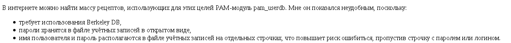

ikiwiki как генератор статических сайтов
========================================

Оглавление
----------

[[!toc startlevel=2 levels=3]]

Введение
--------

Ikiwiki - это продвинутый генератор статических сайтов, написанный на языке Perl. Суть генератора статических сайтов заключается в том, чтобы из каталога с исходными файлами сгенерировать каталог с HTML-файлами. По умолчанию ikiwiki генерирует HTML-файлы только из страниц в разметке Markdown с расширением mdwn, а остальные файлы копирует в полученный сайт "как есть", без преобразования. Но при помощи плагинов, включающихся в работу на различных этапах генерации страниц, возможно расширение и изменение функциональности. По сути, даже поведение по умолчанию выполняется плагинами, которые включены по умолчанию и которые при необходимости можно отключить

Рассмотрим минимальную установку Ikiwiki в NetBSD.

Установка ikiwiki в NetBSD
---------------------------

Установить ikiwiki можно из системы pkgsrc. Пропишем в файле /etc/mk.conf опции сборки самой ikiwiki и пакетов, необходимых для её сборки или работы:

    PKG_OPTIONS.perl=               -debug -dtrace -mstats -threads -perl-64bitall -perl-64bitint -perl-64bitmore -perl-64bitnone perl-64bitauto
    PKG_OPTIONS.ikiwiki=            -cgi -cvs -git -ikiwiki-amazon-s3 -ikiwiki-highlight -ikiwiki-search -ikiwiki-sudo -imagemagick -l10n -python -svn -w3m

Установим ikiwiki:

    # cd /usr/pkgsrc/www/ikiwiki/
    # make install

Теперь нужно определиться с каталогом, в котором будут храниться исходные файлы, и с каталогом, в который будут складываться сгенерированные HTML-страницы сайта. Предположим, что это каталоги src и dst в текущем каталоге. Создадим их:

    $ mkdir src
    $ mkdir dst

Создадим в каталоге src файл с именем index.mdwn и следующим содержимым:

    Привет, мир!
    ============
    
    Это тестовая страница.

Теперь для генерации сайта, на котором есть только одна страница, достаточно одной команды:

    $ ikiwiki src dst

При первом запуске ikiwiki сгенерирует в каталоге dst сайт из всех файлов с расширением mdwn из каталога src. Кроме HTML-файла index.html, сгенерированного из файла index.mdwn, ikiwiki добавит в каталог dst и другие файлы:

* ikiwiki/login-selector/login-selector.js
* ikiwiki/jquery.min.js
* ikiwiki/directive/index.html
* ikiwiki/index.html
* ikiwiki/formatting/index.html
* ikiwiki/markdown/index.html
* ikiwiki/openid/index.html
* ikiwiki/pagespec/attachment/index.html
* ikiwiki/pagespec/po/index.html
* ikiwiki/pagespec/index.html
* ikiwiki/pagespec/sorting/index.html
* ikiwiki/searching/index.html
* ikiwiki/subpage/linkingrules/index.html
* ikiwiki/subpage/index.html
* ikiwiki/wikilink/index.html
* sandbox/index.html
* index.html
* recentchanges/index.html
* favicon.ico
* local.css
* shortcuts/index.html
* templates/note/index.html
* templates/popup/index.html
* templates/index.html
* style.css
* wikiicons/openidlogin-bg.gif
* wikiicons/diff.png
* wikiicons/email.png
* wikiicons/search-bg.gif
* wikiicons/revert.png

В каталоге src появится подкаталог .ikiwiki с файлами indexdb и lockfile. В файле indexdb будут отмечены все исходные и сгенерированные файлы с их отметками времени, а также ссылки страниц друг на друга. С помощью файла indexdb ikiwiki сможет найти новые, удалённые и изменённые файлы и обработать только изменившиеся части сайта.

Для полной перегенерации сайта можно воспользоваться следующей командой:

    $ ikiwiki src dst --rebuild

Файл конфигурации ikiwiki
-------------------------

У сайта ikiwiki имеются дополнительные настройки, которые влияют на генерацию HTML-страниц. Когда мы не указываем ikiwiki файл конфигурации, используются настройки по умолчанию. Давайте сохраним эти настройки в файл, чтобы увидеть их. Чтобы не потерять этот файл, сохраним его в каталог src/.ikiwiki, в котором ikiwiki сохраняет информацию о страницах сайта:

    $ ikiwiki src dst --dumpsetup src/.ikiwiki/ikiwiki.setup

Этот файл имеет формат YML и является аналогом JSON, ориентированным на удобое чтение и редактирование человеком. Для редактирования большинства опций файла конфигурации ikiwiki достаточно помнить, что имя опции и её значение разделяются двоеточием. Хотя опции, принимающие в качестве значений словари или массивы, тут встречаются довольно редко, советую не полениться и ознакомиться с этим форматом. Знание формата поможет сделать файл конфигурации более наглядным и не перегруженным лишними кавычками, квадратными и фигурными скобками.

Рассмотрим опции, которые могут быть полезными для настройки статически генерируемого сайта.

|Опция          |Значение по умолчанию                  |Описание|
|:-------------:|:-------------------------------------:|:-------|
|wikiname       |wiki                                   |Имя сайта, отображаемое в левом верхнем углу сайта. Можно вписать сюда любой текст, но я предпочитаю использовать адрес сайта. В моём случае - stupin.su/wiki/|
|srcdir         |Значение, указанноей в командной строке|Имя каталога с исходными файлами. Для избежания возможной путаницы лучше вписать сюда полный путь.|
|destdir        |Значение, указанноей в командной строке|Имя каталога, в который помещаются сгенерированные HTML-страницы. Для избежания возможной путаницы лучше вписать сюда полный путь.
|url            |Пустая строка                          |Не понятно, на что влияет, т.к. во всех сгенерированных HTML-страницах используются относительные ссылки.|
|indexpages     |0                                      |По умолчанию исходные файлы страниц должны иметь имена вида page.mdwn. Если выставить значение 1, то страницы должны иметь имена вида page/index.mdwn, то есть должны помещаться внутри каталога с именем страницы. Мне такой вариант нравится больше, т.к. внутри каталога можно помещать связанные со страницей картинки и файлы.|
|discussion     |1                                      |По умолчанию для каждой страницы создаётся страница обсуждения. Если выставить значение 0, то страницы обсуждений создаваться не будут. Страницы обсуждений имеют смысл для wiki-сайтов с возможностью редактирования через веб-браузер и не имеют смысла для статически сгенерированных сайтов.|
|default_pageext|mdwn                                   |Расширение исходных файлов страниц. Я уже успел привыкнуть, что для файлов с разметкой Markdown используется расширение md.|
|timeformat     |%c                                     |Формат отметки времени, выводимый в левом нижнем углу страницы. Мне больше нравится формат %Y-%m-%d %H:%M:%S.|
|timezone       |GMT                                    |Часовой пояс, используемый для генерации отметок времени в левом нижнем углу страницы. Я выставил Asia/Yekaterinburg.|
|nodiscount     |0                                      |По умолчанию для преобразования Markdown в HTML используется модуль Text::Markdown::Discount. Если выставить значение 1, то этот модуль использоваться не будет, а на выбор другого модуля будет влиять значение опции multimarkdown.|
|multimarkdown  |0                                      |По умолчанию, если отключено использование модуля Text::Markdown::Discount, будет использоваться модуль Text::Markdown. Если выставить значение 1, то будет использоваться модуль Text::MultiMarkdown.|

Две последние опции требуют отдельного пояснения. Для преобразования разметки Markdown в разметку HTML ikiwiki может использовать один из трёх Perl-модулей: [Text::Markdown::Discount](https://metacpan.org/pod/Text::Markdown::Discount), [Text::Markdown](https://metacpan.org/pod/Text::Markdown) и [Text::MultiMarkdown](https://metacpan.org/pod/Text::MultiMarkdown).

Text::Markdown::Discount
------------------------

Модуль Text::Markdown::Discount использует программу discount, написанную на языке программирования Си, и поддерживает только оригинальный синтаксис Markdown. При использовании этого модуля поблизости с заголовками и списками на русском языке иногда возникают артефакты.

Text::Markdown
--------------

Модуль Text::Markdown - самостоятельный модуль, поддерживающий только оригинальный синтаксис Markdown.

Можно выставить опцию nodiscount в 0 и установить модуль Text::Markdown из pkgsrc следующим образом:

    # cd /usr/pkgsrc/textproc/p5-Text-Markdown
    # make install

При использовании модуля Text::Markdown артефакты исчезают:

Text::MultiMarkdown
-------------------

Модуль Text::MultiMarkdown использует модуль Text::Markdown, но расширяет оригинальный синтаксис Markdown. Самая важная для меня часть этого расширения - поддержка таблиц. Я использую именно этот модуль.

Синтаксис Markdown и MultiMarkdown
----------------------------------

Подробнее о синтаксисе Markdown и MultiMarkdown можно почитать по следующим ссылкам:

* [Markdown: Syntax](https://daringfireball.net/projects/markdown/syntax)
* [The Beginner’s Guide to Writing With MultiMarkdown](https://michaelhyatt.com/multimarkdown/)
* [MultiMarkdown Syntax Guide](https://github.com/fletcher/MultiMarkdown/wiki/MultiMarkdown-Syntax-Guide)

Доработка pkgsrc
----------------

Даже если модуль Text::Markdown::Discount, удалить из системы пакет p5-Text-Markdown-Discount не получится, т.к. pkgsrc с ikiwiki зависит от него.

Чтобы устранить эту жёсткую зависимость и предоставить администратору системы возможность выбора, можно доработать pkgsrc ikiwiki следующим образом:

    wiki# cvs diff -u
    cvs diff: Diffing .
    Index: Makefile
    ===================================================================
    RCS file: /cvsroot/pkgsrc/www/ikiwiki/Makefile,v
    retrieving revision 1.174
    diff -u -r1.174 Makefile
    --- Makefile    24 May 2021 19:55:15 -0000      1.174
    +++ Makefile    26 Jul 2021 06:46:00 -0000
    @@ -12,7 +12,6 @@
     COMMENT=               Flexible static site generator with dynamic features
     LICENSE=               gnu-gpl-v2
     
    -DEPENDS+=              p5-Text-Markdown-Discount-[0-9]*:../../textproc/p5-Text-Markdown-Discount
     DEPENDS+=              p5-URI>=1.36:../../www/p5-URI
     DEPENDS+=              p5-HTML-Parser-[0-9]*:../../www/p5-HTML-Parser
     DEPENDS+=              p5-HTML-Template-[0-9]*:../../www/p5-HTML-Template
    Index: options.mk
    ===================================================================
    RCS file: /cvsroot/pkgsrc/www/ikiwiki/options.mk,v
    retrieving revision 1.22
    diff -u -r1.22 options.mk
    --- options.mk  1 Sep 2020 08:04:23 -0000       1.22
    +++ options.mk  26 Jul 2021 06:46:00 -0000
    @@ -5,7 +5,9 @@
     PKG_SUPPORTED_OPTIONS+=                cvs git svn     # not mutually exclusive
     PKG_SUPPORTED_OPTIONS+=                ikiwiki-amazon-s3 ikiwiki-highlight ikiwiki-search
     PKG_SUPPORTED_OPTIONS+=                ikiwiki-sudo
    -PKG_SUGGESTED_OPTIONS=         cgi ikiwiki-sudo
    +PKG_OPTIONS_REQUIRED_GROUPS=   markdown
    +PKG_OPTIONS_GROUP.markdown=    p5-Text-Markdown-Discount p5-Text-Markdown p5-Text-MultiMarkdown
    +PKG_SUGGESTED_OPTIONS=         cgi ikiwiki-sudo p5-Text-Markdown-Discount
     
     .include "../../mk/bsd.options.mk"
     
    @@ -94,3 +96,15 @@
     SUBST_FILES.w3m=       Makefile.PL
     SUBST_SED.w3m+=                -e 's,^\(.*install .*W3M_CGI_BIN\),\#\1,'
     .endif
    +
    +.if !empty(PKG_OPTIONS:Mp5-Text-Markdown-Discount)
    +DEPENDS+=              p5-Text-Markdown-Discount-[0-9]*:../../textproc/p5-Text-Markdown-Discount
    +.endif
    +
    +.if !empty(PKG_OPTIONS:Mp5-Text-Markdown)
    +DEPENDS+=              p5-Text-Markdown-[0-9]*:../../textproc/p5-Text-Markdown
    +.endif
    +
    +.if !empty(PKG_OPTIONS:Mp5-Text-MultiMarkdown)
    +DEPENDS+=              p5-Text-MultiMarkdown-[0-9]*:../../textproc/p5-Text-MultiMarkdown
    +.endif
    cvs diff: Diffing patches

Эта заплатка добавляет возможность выбора из опций p5-Text-Markdown-Discount, p5-Text-Markdown и p5-Text-MultiMarkdown, первая из которых выбрана по умолчанию. В зависимости от выбора меняются и зависимости пакета ikiwiki. Для установки пакета с активированной опцией p5-Text-MultiMarkdown нужно дописать в файле /etc/mk.conf к списку опций PKG_OPTIONS.ikiwiki опции -p5-Text-Markdown-Discount -p5-Text-Markdown p5-Text-MultiMarkdown, затем пересобрать и переустановить пакет:

    # make clean
    # make
    # pkg_delete ikiwiki
    # make install

Теперь можно удалить зависимости, ставшие не нужными:

    # pkg_delete p5-Text-Markdown-Discount discount

Настройка веб-сервера nginx
---------------------------

Для того, чтобы сгенерированные страницы были доступны через интернет, нужно настроить веб-сервер. Я решил воспользоваться для этого веб-сервером nginx. Пропишем в файле /etc/mk.conf опции, которые потребуются для обслуживания HTML-страниц:

    PKG_OPTIONS.nginx=              -array-var -auth-request -cache-purge -dav -debug -echo -encrypted-session -flv -form-input -geoip -gtools -gzip -headers-more -http2 -image-filter -luajit -mail-proxy -memcache -naxsi -njs -pcre -perl -push -realip -rtmp -secure-link -set-misc -slice -ssl -status -stream-ssl-preread -sub -uwsgi

Соберём и установим веб-сервер nginx из pkgsrc:

    # cd /usr/pkgsrc/www/nginx
    # make install

Добавим в секцию server файла /usr/pkg/etc/nginx/nginx.conf следующие настройки:

    location /wiki/ {
      alias /home/wiki/dst/;
      index index.html;
    }
    
Включим nginx в файле /etc/rc.conf:

    nginx=YES

Осталось запустить nginx:

    # /etc/rc.d/nginx start
